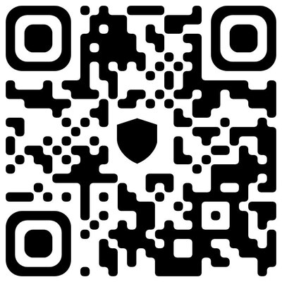
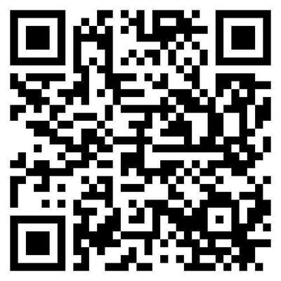

# 🔵 Telegram Circles Desktop

> **Revolutionizing Screen Capturing:** Мгновенное создание и отправка «кружочков» прямо с вашего рабочего стола.

---

## 🌟 Миссия и Амбиции
Проект **Telegram Circles Desktop** возник из простой идеи: общение должно быть живым, быстрым и не иметь границ между устройствами. 

В мобильной версии Telegram «видеосообщения» — один из самых популярных способов передачи эмоций и контекста. На ПК этот функционал до сих пор ограничен веб-камерой. Мы меняем правила игры. Наша цель — дать пользователям возможность превратить **любую область экрана** в живое сообщение, сохраняя фирменный стиль Telegram.

### Почему это важно?
* **Для работы:** Мгновенная демонстрация бага, фичи или части кода коллегам.
* **Для творчества:** Быстрый шеринг моментов из игр или дизайна.
* **Для эмоций:** Вы больше не привязаны к веб-камере. Ваш экран — это ваш холст.

---

## 🚀 Текущий статус: Private Alpha
На данный момент проект находится в стадии активной разработки. Мы оттачиваем точность захвата, оптимизируем DPI-масштабирование и работаем над тем, чтобы приложение работало «бесшовно» на любой конфигурации Windows.

**Что уже работает:**
* ✅ Точный захват области экрана (400x400) с учетом DPI.
* ✅ Плавное перемещение рамки захвата в реальном времени.
* ✅ Прямая интеграция с API Telegram через библиотеку Telethon.
* ✅ Мгновенная конвертация видео через FFmpeg для идеального отображения в мессенджере.

---

## 🗺 Дорожная карта (Roadmap)
- [ ] Оптимизация под macOS и Linux.
- [ ] Добавление записи аудио (системные звуки + микрофон).
- [ ] Интерфейс настроек (выбор качества, FPS).
- [ ] Автоматическая упаковка в легкий `.exe` установщик.

---

## ❤️ Поддержать проект
Разработка проекта требует времени, ресурсов и бесконечного количества кофе. Если вы верите в ценность этого инструмента и хотите ускорить его выход в мир, вы можете поддержать автора. 

Ваши пожертвования пойдут на оплату серверов для тестов и приобретение сертификатов разработчика.

### Отсканируйте QR-код для доната:

| Crypto (USDT/BTC) |        СБП       |
| :---: | :---: |
|  |  |

---

## 🛠 Технологический стек
* **Язык:** Python 3.10+
* **Интерфейс:** PyQt6 (High DPI Support)
* **Захват:** MSS (Screen Capture)
* **Обработка:** OpenCV & FFmpeg
* **Сеть:** Telethon (MTProto API)

---

## 🔒 Конфиденциальность
Приложение работает напрямую через Telegram API. Мы не храним ваши сессии и не передаем данные третьим лицам. Безопасность ваших данных — наш приоритет.

---
*Разработано с ❤️ для пользователей Telegram.*